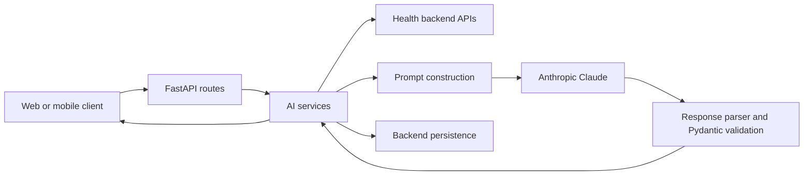

# Pulse_E AI Architecture

## 1. Executive overview

Pulse_E is a FastAPI application that acts as an AI orchestration layer for the health backend. It does not train or host a local machine-learning model. Its AI work is primarily performed by Anthropic Claude through the `anthropic` Python SDK.

The application:

1. Receives a request from the client.
2. Fetches relevant user data from the configured backend APIs.
3. Builds a task-specific system prompt and user prompt.
4. Sends text, or text plus images for skin scans, to Claude.
5. Extracts Claude's response text.
6. Parses and validates the result into Pydantic response models.
7. Returns the result to the client and, for live skin scans, attempts to persist it to the backend.



## 2. Project structure

| Area | Responsibility |
| --- | --- |
| `main.py` | Creates the FastAPI app and registers all routers. |
| `ai/routes/` | HTTP and WebSocket entry points. Routes should remain thin and delegate to services. |
| `ai/services/` | Backend data fetching, prompt construction, Claude calls, parsing, fallbacks, and feature logic. |
| `ai/models/` | Pydantic request and response contracts. |
| `ai/utils/claude_llm.py` | Shared low-level Anthropic client wrapper. |
| `ai/utils/llm_call.py` | Shared text-only Claude helper used by most services. |
| `ai/utils/llm_response_parser.py` | Extracts text and token usage from Anthropic responses. |
| `ai/config.py` | Environment-backed settings, backend URLs, Claude API key, and Claude model name. |
| `ai/workflows/` | Present as a package, but the main AI flows currently live in services rather than a workflow engine. |
| `data/` | Local application data, including the chat history database path configured in settings. |

## 3. AI feature map

The registered AI routes are:

- Chat: `/api/chat/response` and `/api/chat/history`
- Cycle awareness: `/api/cycle-awareness`
- Cycle engine and fertility calculations: `/api/v1/cycle-engine/*`
- Health trends: `/api/health-trends`
- Daily scripture: `/api/daily-scripture`
- Numera insight: `/api/numera-insight`
- PDF and lab-report summaries: `/api/summarize-pdf` and `/api/lab-reports`
- Skin scan: `/api/skin-scan`, `/api/skin-scan/live`, and `/api/skin-scan-ws`
- Smart analysis: `/api/smart-analysis`
- Trying to conceive: `/api/trying-to-conceive`

Most text-based services call `ai.utils.llm_call.llm_call()`. That helper creates `ClaudeLLM`, calls Claude, and returns extracted text. The skin-scan service calls `ClaudeLLM` directly because it must send Anthropic image content blocks as well as text.

## 4. Claude integration

`ai/utils/claude_llm.py` is the single client wrapper. It reads:

- `CLAUDE_API_KEY` from `.env` or the process environment.
- `CLAUDE_MODEL` from configuration. The code default is `claude-opus-4-7`, but an environment value overrides it.

The wrapper sends requests using Anthropic's messages API:

```python
client.messages.create(
    model=model,
    max_tokens=max_tokens,
    messages=messages,
    system=system,
)
```

There is no local fine-tuning, embedding database, or local vision model in this project. The backend data is supplied as prompt context at request time. LangChain is used in the chat service for prompt templates and runnables, but Claude remains the model doing the language analysis.

## 5. How a normal text request is analyzed

The chat path is representative:

1. The client posts a `ChatResponseRequest` containing `user_id`, `message`, and optional session/report fields.
2. The service checks the user's subscription quota.
3. It fetches profile, temperature, health-log, cycle-snapshot, and, when relevant, lab/PDF context.
4. It loads recent conversation history and the long-term memory summary from the local chat store.
5. It combines all of that data with `CHATBOT_SYSTEM_PROMPT` and `CHAT_MESSAGE_TEMPLATE`.
6. Claude receives a text-only request and produces a natural-language response.
7. The response is cleaned, stored in history, and returned as `ChatResponse`.

The chat prompt explicitly tells Claude to use actual supplied data, avoid inventing values, avoid diagnosis or prescriptions, and state when data is unavailable. Those are prompt-level safeguards; they are not a substitute for clinical validation.

## 6. Skin-scan analysis in detail

### 6.1 Inputs

The HTTP endpoint `/api/skin-scan` accepts one of:

- Multipart image upload.
- `image_url`.
- Base64 image data in `image_base64` or `image`.
- A data URL containing an image.

The WebSocket endpoints `/api/skin-scan/live` and `/api/skin-scan-ws` accept multiple frames. The server starts a 20-second capture window after the first valid frame. The client can also send `{ "type": "finalize" }` to stop early.

For a live session, the service keeps all received frames in memory, selects at most 10 evenly distributed frames, and sends those selected frames to Claude together in one request.

### 6.2 Context fetched before analysis

Before analysis, the service fetches:

- `CYCLE_ENGINE_PROFILE_URL` as `user_profile`.
- `HEALTH_TRENDS_HEALTH_LOGS_URL` as `health_logs`.

That context is serialized to JSON and truncated to `MAX_CONTEXT_CHARS` (6,000 characters). It is included in the prompt as wellness context. The user ID is also extracted from several possible profile response shapes.

### 6.3 How the image reaches Claude

The image is not sent to a separate computer-vision service. The service:

1. Reads the image bytes.
2. Base64-encodes the bytes.
3. Builds an Anthropic multimodal content list containing an `image` block and a `text` block.
4. Sets the image media type to JPEG, PNG, WebP, or GIF.
5. Sends that content in a user message to Claude.

For a session, the content list contains each selected image followed by a frame label, then the combined analysis prompt.

Conceptually, Claude receives:

```json
{
  "role": "user",
  "content": [
    {
      "type": "image",
      "source": {
        "type": "base64",
        "media_type": "image/jpeg",
        "data": "<base64 image bytes>"
      }
    },
    {"type": "text", "text": "Analyze this user's skin and return JSON..."}
  ]
}
```

### 6.4 What Claude is asked to assess

The skin system prompt asks Claude to visually assess:

- Texture and visible fine lines or roughness.
- Hydration indicators such as dryness, flaking, or apparent plumpness.
- Redness and visible uneven tone.
- Pore visibility and apparent congestion.
- Glow or radiance versus dullness.
- Apparent elasticity or firmness.

The requested numeric fields are all integers from 0 to 100:

- `overall_score`
- `hydration_score`
- `redness_score`
- `texture_score`
- `glow_index`
- `pore_health_score`
- `elasticity_score`

Redness is intentionally inverse to the other scores: a lower `redness_score` means less visible redness and is considered better. The prompt also requests a status string for each metric and a short `neumera_insight`.

For live sessions, the optimized path asks Claude for both metrics and 3-5 recommendations in one response. This avoids the second model call used by the older separate recommendation path.

### 6.5 Response processing

The service asks Claude to return JSON only. Because model output can still contain code fences or surrounding prose, the parser:

1. Removes Markdown code-fence lines when present.
2. Extracts the substring between the first `{` and the last `}`.
3. Runs `json.loads`.
4. Requires all seven score fields.
5. Clamps numeric values to 0-100 and validates the final structure with Pydantic.
6. Derives missing status fields from scores, while preserving non-empty statuses supplied by Claude.

The combined live-session response must contain both `metrics` and `recommendations`. If it cannot be parsed or validated, the request fails instead of silently returning fabricated metrics. The separate recommendation function has a score-based fallback, but the preferred combined live-session path requires a valid combined response.

### 6.6 Persistence and returned result

After a successful WebSocket analysis, the service sends the representative final frame and metric fields to `SKIN_SCANS_URL`. Persistence is best effort: if the backend rejects the upload, the analysis is still returned with a local fallback image path and no database ID.

The WebSocket result includes:

- Session and frame metadata.
- Validated metric fields.
- The persisted scan response when available.
- Today's recommendations.

## 7. What Claude can and cannot conclude from a scan

Claude can provide a visual, approximate wellness assessment of visible image features when the image has adequate lighting, focus, resolution, and a usable angle. It can compare multiple frames and turn the requested observations into consistent application fields.

Claude cannot reliably measure hydration, elasticity, pore size, or skin biology from an ordinary consumer image. It cannot establish a medical diagnosis, determine the cause of redness, measure hormone effects, or replace a dermatologist. The current implementation correctly instructs it not to diagnose, but the numeric scores should be presented to users as visual estimates or wellness indicators, not clinical measurements.

The result can also vary with lighting, camera processing, makeup, filters, distance, pose, and image quality. Multiple frames reduce some capture variance but do not turn the result into a calibrated measurement.

## 8. Review findings and recommended hardening

### High priority

- Treat skin scores and recommendations as non-clinical estimates in API documentation and UI copy. The current model and prompt do not provide clinical validation.
- Add explicit consent and retention controls before sending health context and face/skin images to a third-party AI provider. The skin service currently sends profile and health-log JSON alongside the image when available.
- Ensure production traffic is HTTPS and keep API keys and backend tokens out of logs and error responses.

### Medium priority

- Replace `print` statements that include the first 500 characters of Claude responses. Model output may contain user-derived or sensitive information.
- Record model name, prompt version, input quality checks, and token usage in privacy-aware observability data. `LLMResponseParser` already exposes token usage, but the main service paths do not consistently record it.
- Add image size, dimension, and pixel-quality validation before base64 encoding. File type checks alone do not guarantee a useful scan.
- Add rate limits and per-user limits to both the HTTP and WebSocket scan endpoints. A 20-second session can hold many frames in memory.
- Keep the backend URL allowlist and SSRF tests under regression coverage for `image_url` and storage paths.

### Testing gaps

- Current WebSocket testing exercises the protocol, but a deterministic mocked-Claude test should verify multimodal payload construction and combined JSON parsing.
- Add tests for malformed model JSON, missing score fields, invalid media types, oversized images, empty frames, backend persistence failure, and unavailable context APIs.
- Add golden tests for the redness score semantics so a lower redness value remains the healthier result.

## 9. Short answer

The AI part is a prompt-and-orchestration layer around Claude. For a skin scan, Pulse_E sends Claude the actual image as a base64 multimodal input plus an instruction to inspect visible skin characteristics and return a strict JSON schema. Pulse_E then validates that JSON and exposes it as wellness metrics and recommendations. It is not currently a trained skin-diagnostic model or a clinical measurement system.